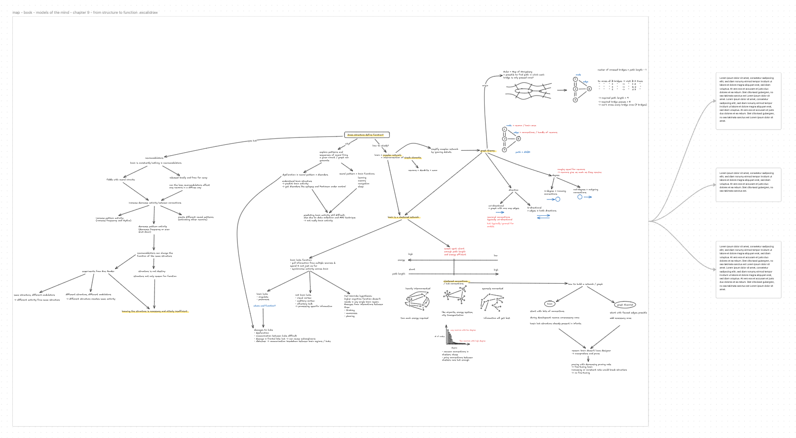

After going through the mindset for learning, it's now time to talk about a
place to learn. A place where you can collect materials, plan your learning and
actually learn. It can be fun and adventurous to research and adjust your
learning system. But it also bears a trap. A trap in which you never start
learning but constantly look for a perfect system. Adjusting your learning
system and searching for the perfect setup can get annoying and frustrating.
You might spend more time looking for the perfect system than actually
learning.

So let's make it simple.

LeLe adds yet another approach to structuring your learning place: the lama+n
system.

It's ironic, but maybe this learning system will stop the hunt for the perfect
system. Or you can just skip it if you already have a decent one that works for
you.

I implemented my learning system in Obsidian which is why I use Obsidian as an
example here. But you can also implement it within any other app you prefer and
like. All you need are notes and canvases. I abandoned folders and just use a
global search. But you can, of course, implement it in folders as well.

So let's start talking about the lama+n system:

## l: learnings + materials

Learning+materials are notes in which you save learnings or materials with
relevant information regarding the material or learning. But what are learnings
and materials? A note for a certain material contains information like the type
of material (book, article, video), title, link, tags, author, etc.

Learnings are notes in which you plan what you want to learn. They are
self-created learning units. Inside a learning note, you have a collection of
relevant materials, why you want to learn it, the scope you want to cover
within the learning, an idea on how to practice and the time you want to
invest.

We will cover how to plan your learnings in more detail in a later article "how
to plan your learning". For now let's continue with LAMA+N.

## a: areas

Areas are notes for all the different areas you are interested in. For myself,
it's Coding, Design, Neuroscience and Philosophy.

These area notes are places where you link to relevant learnings and materials.
It's like a hub to collect, organize and even find relevant materials or
learnings. Inside an area note, you can divide the materials and learnings into
sections of focus (currently doing), done (already finished) and idle (might
want to do it in the future).

As you see below, it doesn't only have to be linked to your material and
learning notes. You can also add idle links to websites, videos and articles
without creating material notes for them. Once they become relevant you can add
them to a learning note or create material notes for them.

The area note also contains links to maps. But what are maps exactly?

## m: maps

Maps are the third part of LAMA+N. Maps are canvases which you use to create
mind maps. Mind maps from learnings, individual materials like books, or
general-purpose mind maps covering multiple learnings and materials.

In Obsidian, I like to use Excalidraw and the Excalidraw plugin. But there are
a lot of other options too to create and maintain mind maps. Some of which
might be even better suited for mind mapping. In Obsidian, you can also use the
built-in canvas feature. But I feel like Excalidraw is better suited for mind
mapping. You can also use Excalidraw without Obsidian. Excalidraw might be even
supported in your choice of app too.

Mind maps are the main learning tool of LeLe and we will go into more detail on
how to mind-map in the learning chapter.

The maps/canvases you create should be mentioned via links in the respective
learnings, materials and even areas (as seen in the screenshot above).

## a: archive

But of course, you already have an existing system. What are you going to do
with all your old notes? I had the same struggle and followed the advice of
Tiago Forte. Moving everything into your new system is not an option. It just
takes too much time. Therefore, just dump everything into an archive folder. If
I need or stumble across an old note or material, I'll pick it up from the
archive and move it to the new system.

## +n: notes if needed

Notes are simply notes. The main learning method is mind mapping and it will
happen mostly inside a canvas or map. But if you have any details which make
the map too messy, you can create a note, put all the details in there and link
to it from the canvas. This way details don't get lost and your mind map stays
clean.

And that's it. This is the LeLe learning place called LAMA+N.
