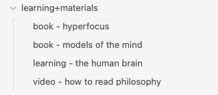
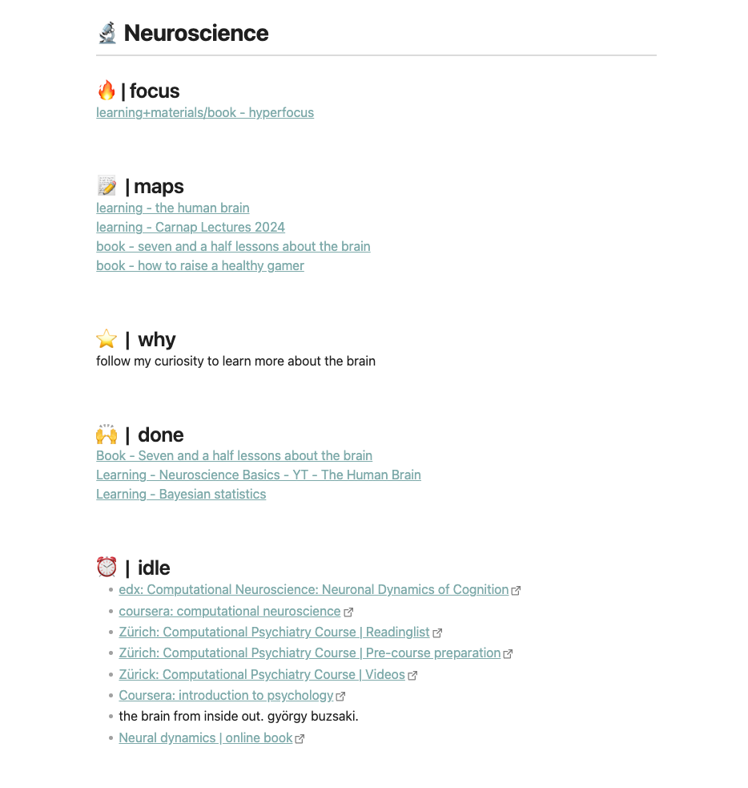
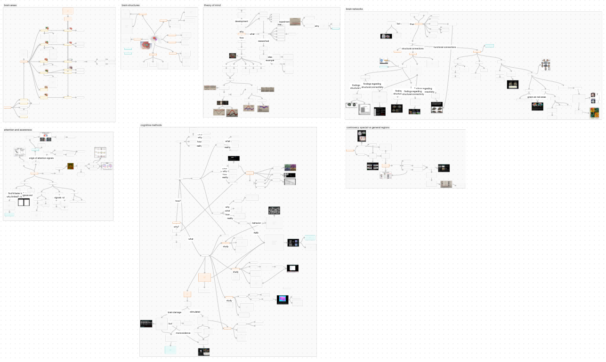

After going through the mindset for learning, it's now time to talk about the
place to learn. A place where you can collect materials, plan your learning and
actually learn. It can be fun and adventurous to research and adjust your
learning system. But it also bears a trap. Constantly adjusting your learning
system and searching for the perfect setup can get annoying and frustrating.
You might spend more time looking for the perfect system than actually
learning.

So let's make it simple.

LeLe adds yet another approach to structuring your learning place: the lama+n
system.

It's ironic, but maybe this learning system will stop the hunt for the perfect
system.

I implemented it in Obsidian which is why I use Obsidian as an example here.
But you can also implement it within any other app you prefer and like. All you
need are folders, notes and canvases.

## l: learnings + materials

Learning+materials is a folder in which you save learnings and materials. Both
are notes/pages with relevant information regarding the material or learning.
Materials make sense but you might be wondering what learnings are.

Learnings are notes/pages in which you plan what you want to learn. Inside a
learning note, you have a collection of relevant materials, why you want to
learn it, the scope of topics you want to cover with the learning, an idea of
how you want to practice and the time you want to invest into the learning.

We will cover how to plan your learnings in more detail in a later article "how
to plan your learning".

## a: areas

Areas is a folder containing notes/pages on all the different areas you are
interested in. For myself, it's Coding, Design, Neuroscience and Philosophy.

These area notes are places where you link to relevant learnings and materials
from the learning+material folder. It's a place to collect area-relevant
content. Here, you can divide the materials and learnings into sections of
focus (currently doing), done (already finished) and idle (might want to do it
in the future).

As you see below, it doesn't only have to be linked to material and learning
notes/pages. You can also add idle links to websites, videos and articles. Once
they become relevant you can add them to a learning or create materials for
them.

Additionally, you can link to relevant maps inside the area notes. But what are
maps exactly?

## m: maps

Maps are the third part of LAMA+N. Maps is a folder in which you store all your
mind maps. Mind maps from learnings, individual materials, or general-purpose
mind maps covering multiple learnings and materials.

In Obsidian I like to use the canvas for this but there are a lot of other
options too to create and maintain mindmaps. Some of which might be even better
suited for mind mapping.

Mind maps are the main learning tool of LeLe and we will go into more details
on how to mind-map in the learning chapter.

The maps/canvases you create can then be linked to or mentioned in the
respective learnings, materials and even areas (like you saw in the screenshot
above).

## a: archive

But of course, you already have an existing system. What are you going to do
with all your old notes? I had the same struggle and followed the advice of
Tiago Forte. Moving everything into your new system is not an option. It just
takes too much time. Therefore, I just dump everything into an archive folder.
If I need or stumble across an old note or material, I'll pick it up from the
archive and move it to the new system.

## +n: notes if needed

Notes is an optional folder. The main learning method is mind mapping and it
will happen mostly inside a canvas/map. But if you have any details which make
the map too messy, you can create a note, put the note inside the notes folder
and link to it from the canvas. This way details don't get lost and your mind
map stays clean.

And that's it. This is the LeLe learning place called LAMA+N.
