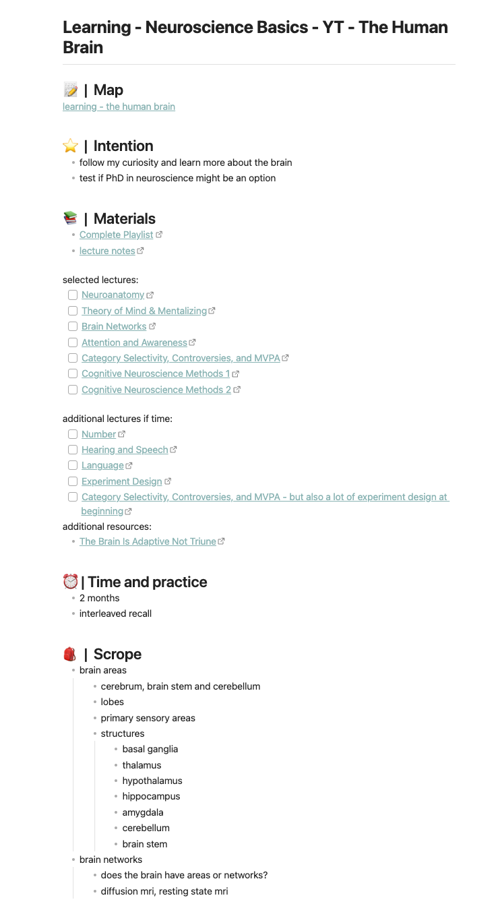

The problem with typical learning plans is that we often make a rigorous plan,
we don't define why we want to learn, what we want to learn and we don't
include any practice. This results in randomly learning a bit here and there,
trying to transcribe and cram everything instead of understanding it. It often
also results in giving up on learning alltogether.

But there might be an alternative to this standard way of planning. The idea is
based on a project management approach of Basecamp. They use it to build
software. The method is called Shape Up and was developed by Ryan Singer.
Instead of planning, they refer to it as shaping.

LeLe tries to apply some of the insights from Shape Up to learning.

## why to shape your learning

Shaping helps your planning have the right level of abstraction, make it
intentional and constrain it.

The right level of abstraction is necessary so that you know what you are going
to learn and leave room for unplanned open questions and gaps in your
understanding. You can't plan for everything from the start. There will be
surprises. So making it a bit more abstract will allow you to adjust, leave
something out or include not expected parts.

Making it intentional and defining why you want to learn it, will boost your
motivation.

Finally, constraining your learning will prevent it from spiralling out of
scope. There are always new concepts and topics to explore or dig deeper into.
This only results in a never-ending story. So constrain your learning to have a
clear space in which you can learn.

## how to shape your learning

Create a new note/page (note in Obsidian; page in Notion or what it is called
in your tool of choice) and save it in your "learning+material" folder. Link to
it in your respective area.

To make it intentional, first, write down why you want to learn this specific
topic.

After that, it is time to give it the right level of abstraction. Collect
relevant materials either from your "idle" section in your area or research new
resources - articles, videos, books. Then it is time to skim them. Probably not
all of them but enough so that you can create a rough imagined scope of what
you are going to learn. It doesn't have to be detailed. It shouldn't be
detailed. It should give you an idea of the scope you are trying to learn.

This abstract scope also helps to test your curiosity to see if you really want
to learn it.

Finally, you have to constrain your learning and define a clear goal. The goal
helps you to aim and gives you a sense of direction even if you don't reach it
exactly. It prevents learning from spiralling out of control. Additionally,
define how much time you want to invest into this learning.

Finally, you also have to write down how you want to practice what you learnt.
Do you want to apply your new knowledge to a project (can be done after or
while studying all the content)? Or are you building up knowledge and wanting
to practice it via interleaved recall and testing? More on practice will be in
the learning section. But the main difference between project and testing is
that the project one is more focused on learning a skill and the testing one is
more focused on learning information.

## an example

A shaped learning (and in this case a finished learnig) might looks like this:

As you can see the learning also includes a "map". This is an Obsidian canvas
used for mind mapping. But you can link to any kind of mind map you created
(which ever tool you prefer).

This is the idea on how to shape a learning. You can even shape multiple
learnings, weigh them against each other and decide which one you want to focus
on. This way you don't get distracted by your curiosity. You don't question
yourself "Should I have been learning something else?". After you are done with
the learning you can always come back to the rest of your shaped learnings.

This makes learning like an experiment.

Until now you only focused on learning things we planned for. Shaped learning.
But there is also unplanned learning. When you randomly stumble across
interesting insights or knowledge and don't want to lose it or wait until it
fits into a learning. You just want to connect the ideas somewhere and learn
from them immediately. This is called scattered learning in LeLe and will be
discussed in the next article.
