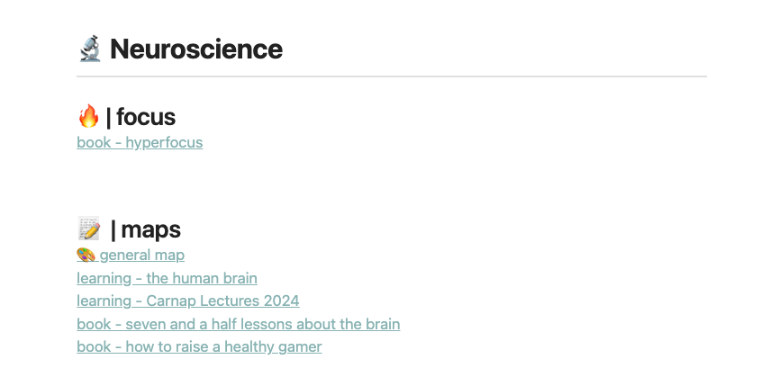
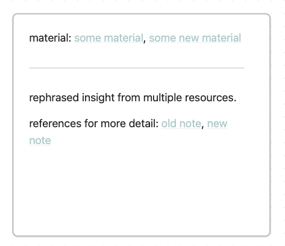

Up until now, we only discussed shaped/planned learning inside the LAMA+N
system. The main idea here is to collect materials and assemble them into a
learning unit. You can even shape multiple learnings and deliberately decide
what to focus on and what to ignore.

Besides taking time to plan a whole learning, there are also moments in which
you want to learn immediately. You stumble across an interesting article or
video with intriguing insights. You don't want to put it aside as idle material
for a potential future learning. You want to make use of the insight now.

This, in contrast to shaped learning, is scattered learning. Random insights
that are scattered around, from which you want to learn but can't wait to make
a whole shaped learning. Maybe they even don't fit into a learning. Instead of
losing them, you can take advantage of scattered learning.

Scattered learning happens and we should not avoid it. Scattered learning deals
with small insights. One article or one video. Not a series of lectures which
might be better suited for a shaped learning.

## how to scatter learn in LeLe

LeLe also has room for scattered learning. Just create a general mind map
(Obsidian canvas, Excalidraw board or whatever mapping tool you prefer). Link
to the general mind map at the map section of your area (called "🎨 general
map" in the screenshot below).

This is your area-specific map for scattered learning.

If you come across an interesting material (article or video) and want to make
use of the insights immediately, you create a new material note. Save it in the
"learnings+materials" folder, add all the material details (title, link, etc)
and link to the material in the respective area.

After that, collect the insights from the material and try to connect them to
my general mind map. Create as many notes as you need but try to keep them
short. The notes in my Obsidian mind map look simple like this:

The note contains a link to the material and a short insight. After collecting
some notes, connect them to other existing notes inside your mind map.

## how to deal with duplicated insights

Sometimes it also happens that two or more notes contain the same insights in
slightly different words. To avoid getting messy in your mindmap there are two
options. First, you combine your notes by just adding the material from the new
note to the existing note and deleting the new note.

Second, you can convert both notes to files (in Obsidian), save them in the
notes folder (the +N in LAMA+N; a place for detailed notes), combine both notes
into a new one inside your map and link to both files as detailed references.

This way your mind map doesn't get messy and stays clean.

## combine scattered and shaped learning

You can also use your general mindmaps to add a few specific insights from your
shaped learnings in addition to the scattered learning insights. Of course,
your learnings have their own mindmaps. But to avoid being too isolated, you
can add a few insights from your shaped learning to your general mindmap after
you are done with it. Inside these notes, you can then reference the shaped
learning as a material. This way you get the best of both worlds - scattered
and shaped.
