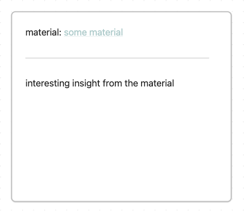
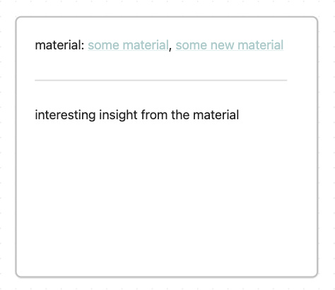

Up until now, we only discussed **shaped/planned learning** inside the LAMA+N
system. The main idea here is to collect materials and assemble them into a
learning unit. You can even shape multiple learnings and deliberately decide
what to focus on and what to ignore.

Besides taking time to plan a whole learning, learning can also happen
spontaneously - **scattered learning**. Scattered learning, in contrast to
shaped learning, deals with random insights we stumble across while, let's be
honest, doom-scrolling on our phones. Instead of losing the insight or putting
the materials aside as idle material, you want to quickly capture it. Take
quick notes and connect them to your existing knowledge.

## how to scatter learn in LeLe

LeLe also has room for scattered learning. Random insights we find captivating
are often related to one of our areas of interest. Thus, each area not only
consists of planned learnings but can also house scattered learning insights.
Start by creating a general scattered mind map (Obsidian canvas, Excalidraw
board or whatever mapping tool you prefer). Link to the general mind map at the
map section of your area (here called "🎨 general map" in the screenshot
below).

This is your area-specific map for scattered learning.

If you come across an interesting material (article, video or image) and want
to make use of the insights immediately, you create a new material note. Add
all the material details (like title, link, etc) and link to the material in
the respective area.

After that, collect the insights from the material and try to connect them to
your general scattered mind map. Create as many insight notes as you need but
try to keep them short and try to rephrase them in your own words. These notes
can look as simple as this:

The note contains a link to the material and a short insight. After collecting
some notes, connect them to other existing notes inside your general scattered
mind map.

I like to use the Obsidian canvas for scattered learning because it feels more
like an open board with free to move index cards.

<!-- TODO add screenshot from philosophy map -->

## how to deal with duplicated insights

Sometimes it also happens that two or more notes contain the same insights in
slightly different words. To avoid getting messy in your mindmap there are two
options. First, you combine your notes by just adding the material from the new
note to the existing note and deleting the new note.

Second, you can convert both notes to files in Obsidian, combine both notes
into a new one inside your map and link to both files/notes as detailed
references.

This way your mind map doesn't get messy and stays clean.

## combining scattered and shaped learning

You can also use your general mindmaps to add a few specific insights from your
shaped learnings in addition to the scattered learning insights. Of course,
your learnings have their own mindmaps. But to avoid being too isolated, you
can add a few insights from your shaped learning to your general mindmap.
Inside these notes, you can then reference the shaped learning as a material.
This way you get the best of both worlds - scattered and shaped.
